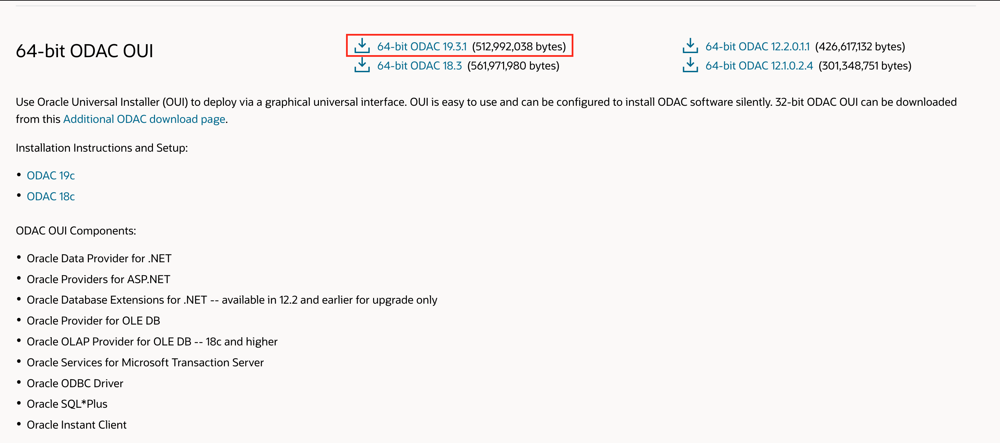
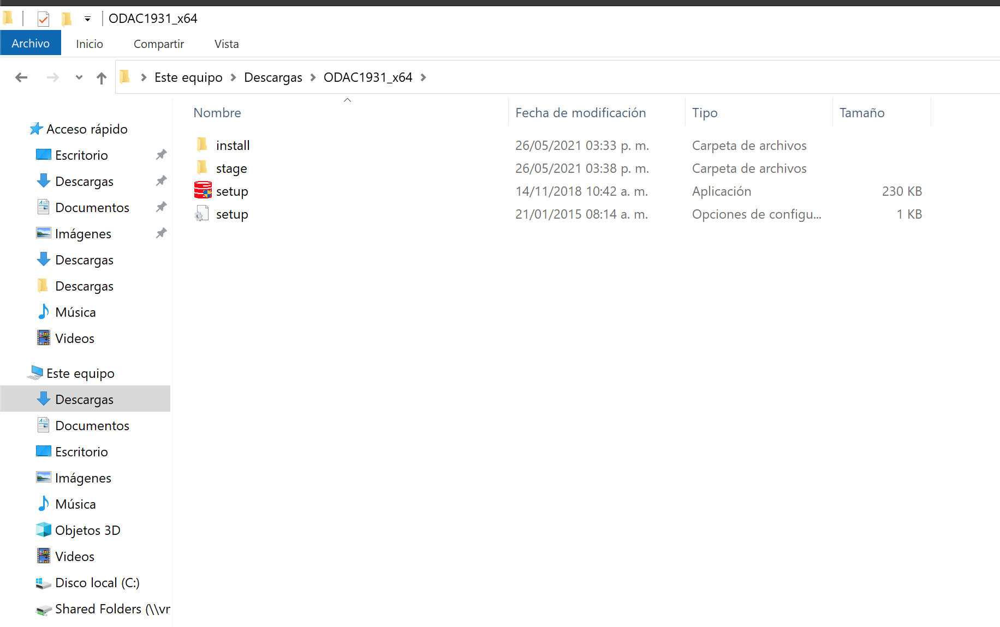
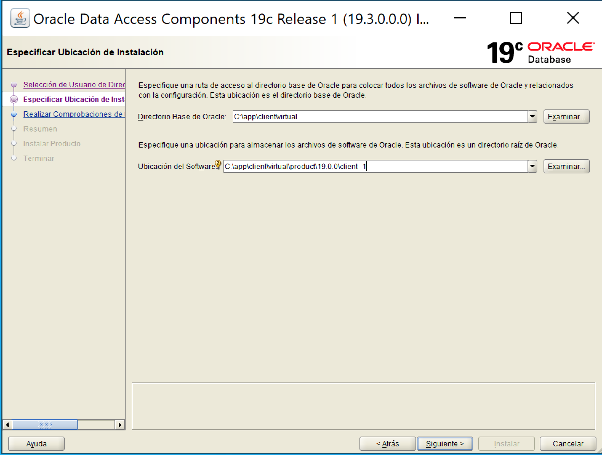
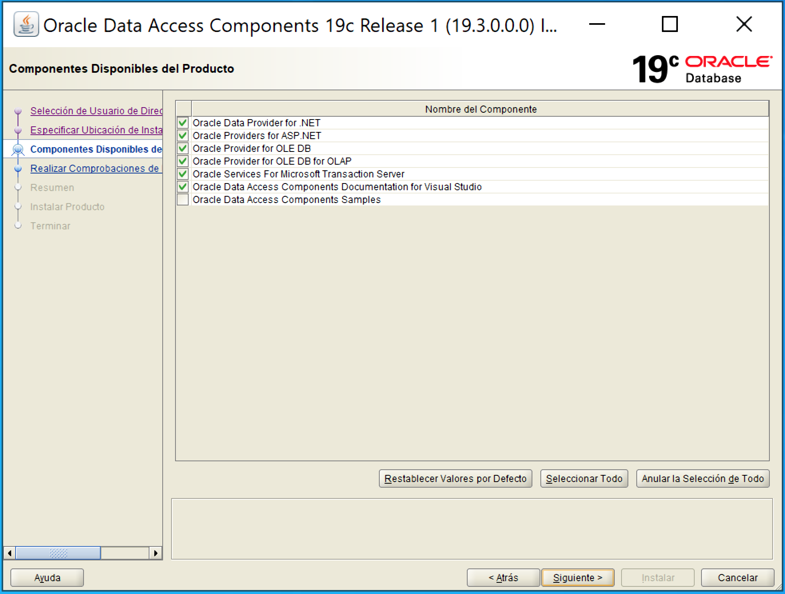
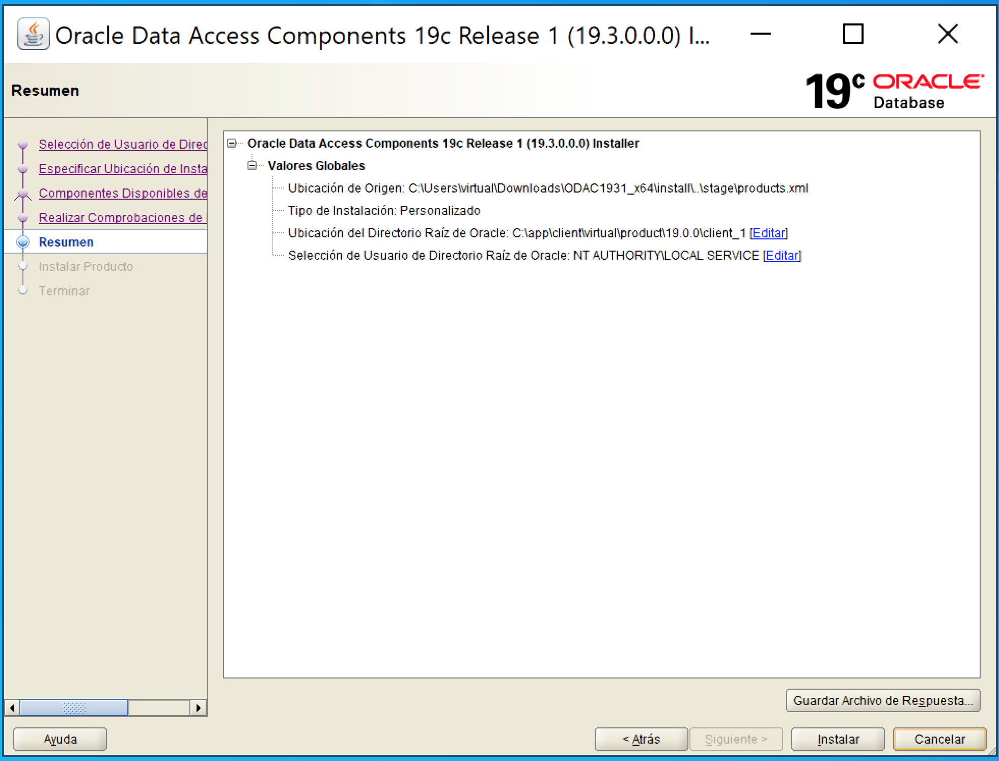
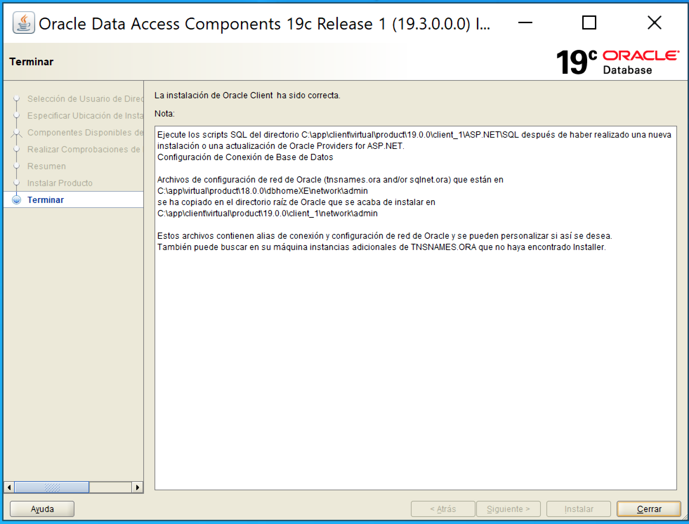

# Instalación de Oracle Data Provider for .NET

[Volver](../readme.md)

## Requisitos

- [Oracle Data Provider for .NET (ODP.NET)](https://www.oracle.com/database/technologies/dotnet-odacdeploy-downloads.html)

## Pasos de Instalación

Ingresaremos al link que esta en los requisitos. Desde aquí podemos elegir entre los 2 tipos de instalación que ofrece oracle (Xcopy y ODAC OUI).

Para el ejemplo elegiremos la versión 64-bit ODAC OUI 

1. Al extraer el contenido del .zip ejecutaremos el archivo setup.exe para comenzar la instalación 

2. Seleccionamos la ubicación donde realizaremos la instalación del cliente de oracle 

3. Elegimos las librerías de .net que deseamos instalar 

4. Una vez seleccionado todo lo necesario el instalador nos mostrar un resumen de ello, procederemos a confirmar la instalación 

5. Cuando haya finalizado la instalación se mostrara la siguiente ventana con el resumen de la instalación 

**Importante:** *cuando actualicemos la configuración del archivo `TNSNAME.ora` de la ruta del home de la base de datos, también debemos actualizar en la instalación del cliente. Esta ruta es la ruta que configuramos al momento de instalar ODAC como muestra en la imagen final de la instalación*