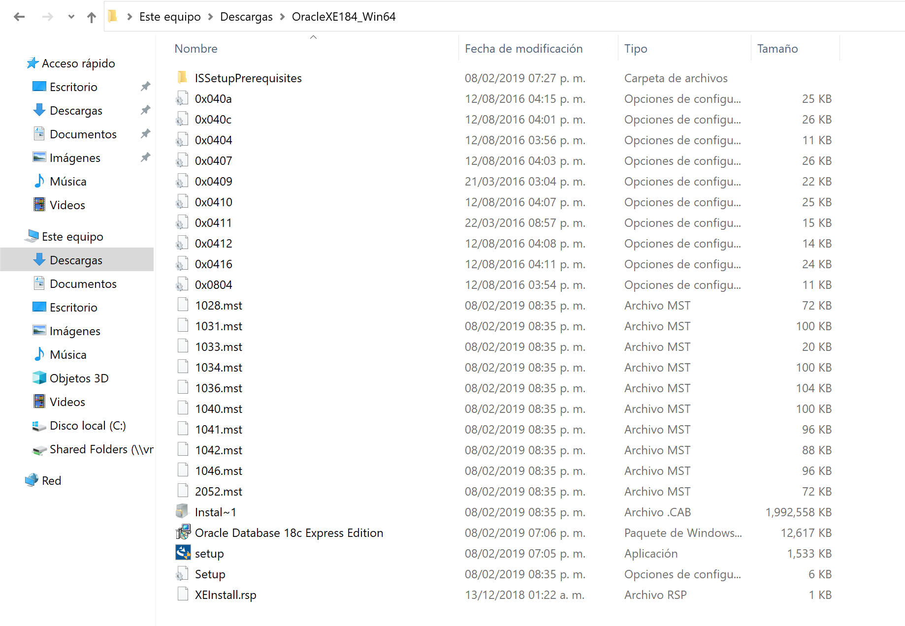
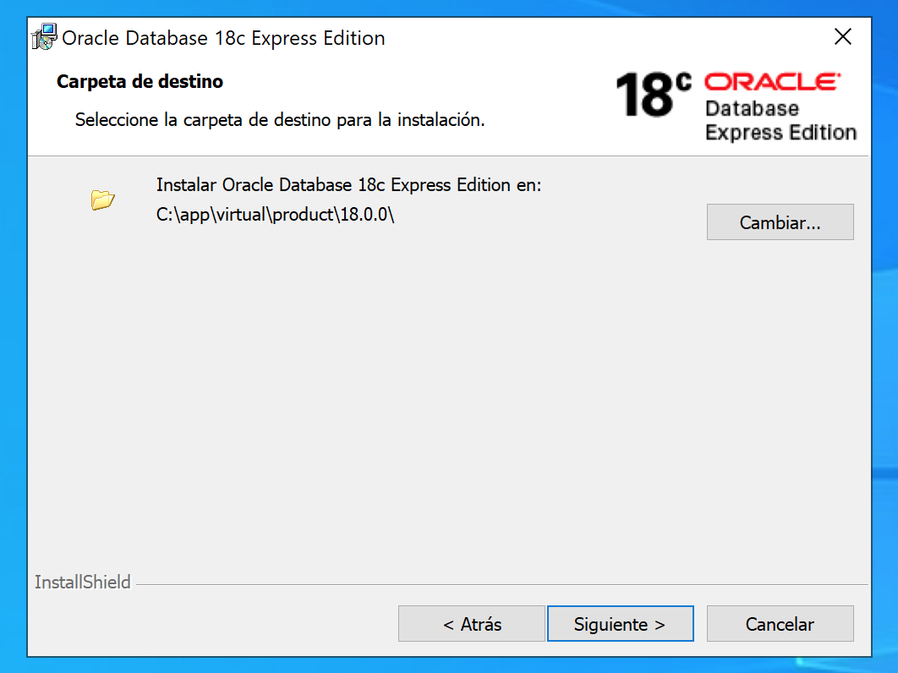
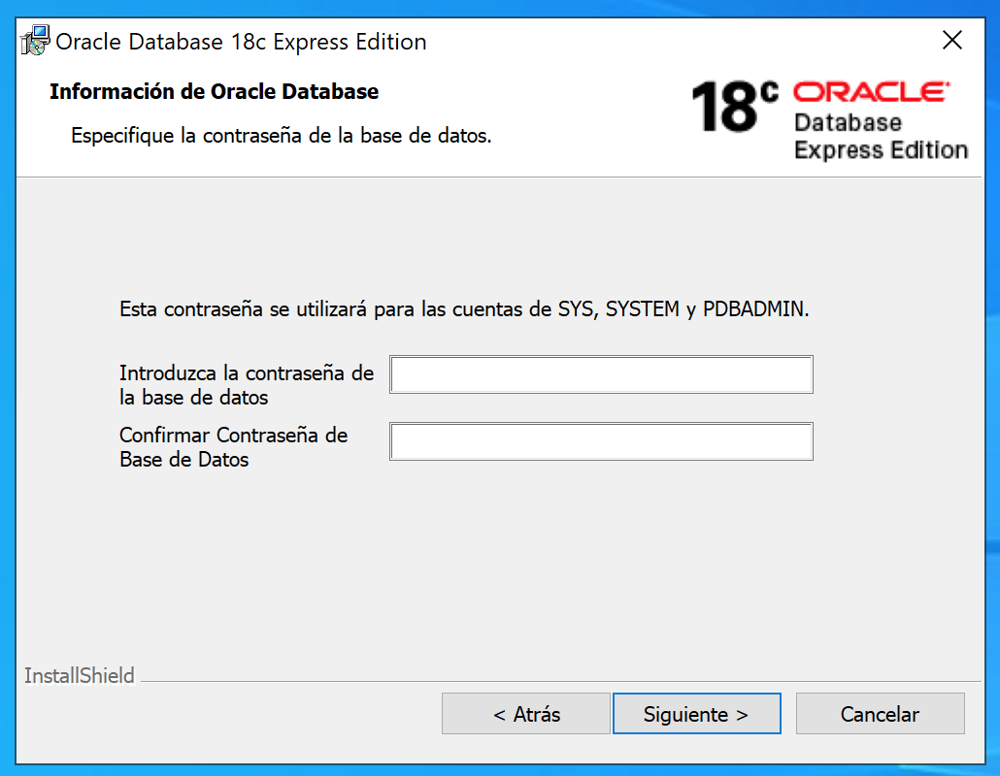
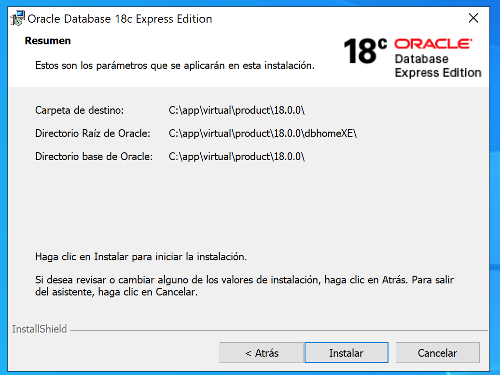
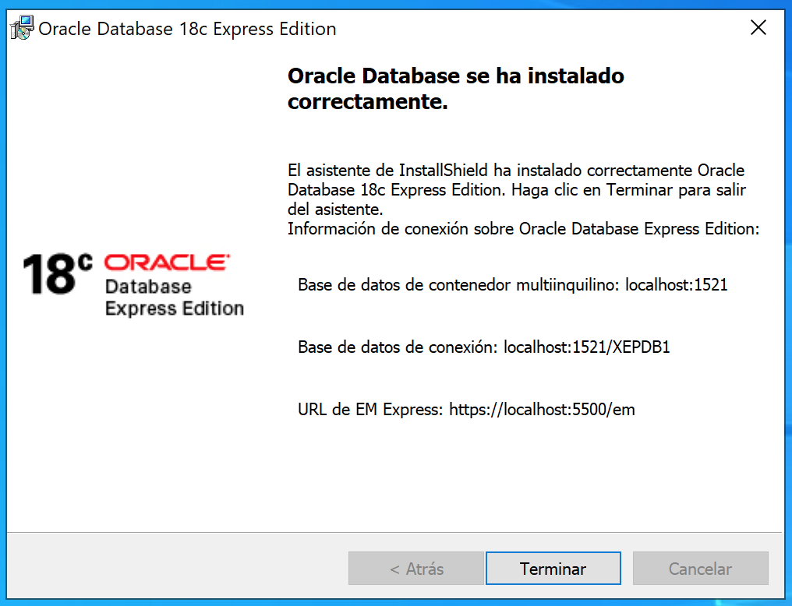
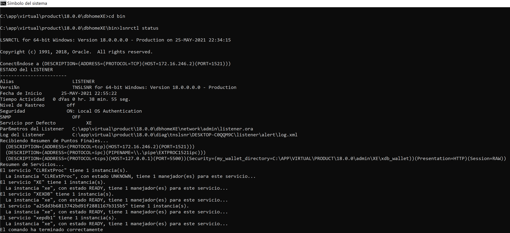

# Instalación de Oracle Database XE

[Volver](../readme.md)

## Requisitos

- [Oracle Database XE](https://www.oracle.com/database/technologies/xe-downloads.html)

## Pasos de Instalación

1. Extraer el contenido del zip y ejecutamos el archivo `setup.exe` para iniciar la instalación. 

2. Seguir los pasos de instalación y elegir la ubicación en donde se instalara el producto. 

3. Establecer la contraseña que se usara para acceder a la base de datos. 

4. Tener en cuenta las ubicaciones que se muestran aquí para futuras configuraciones 

5. Al finalizar Oracle nos indicara las rutas por las cuales podemos acceder a la base de datos instalada. 

6. probamos la instalación abriendo una terminal e ingresando lo siguiente: `cd <oracle_home>\bin`y `lsnrctl status` 

Con esto podemos verificar que esta funcionando correctamente la instalación de la base de datos y que están escuchando los puertos para oracle.

**Nota:** *Recuerda que durante la instalación se pedirá al usuario dar permisos en el firewall*
