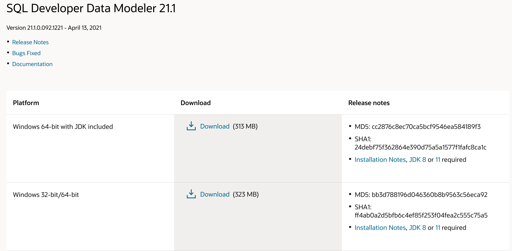
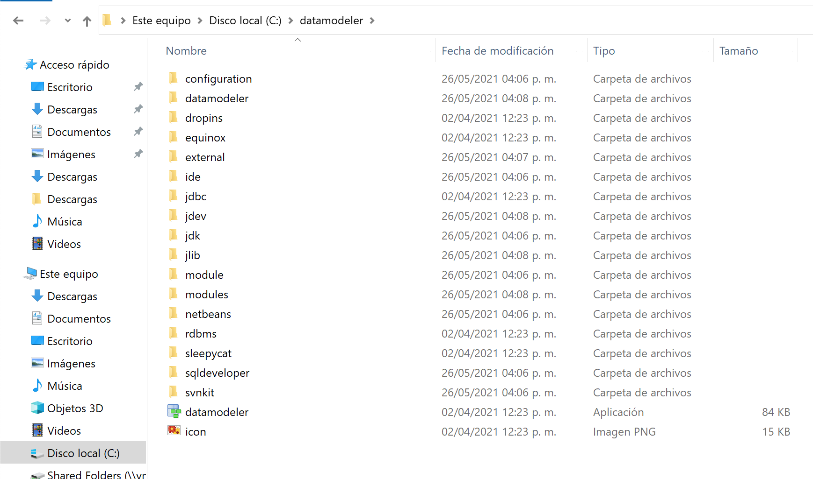
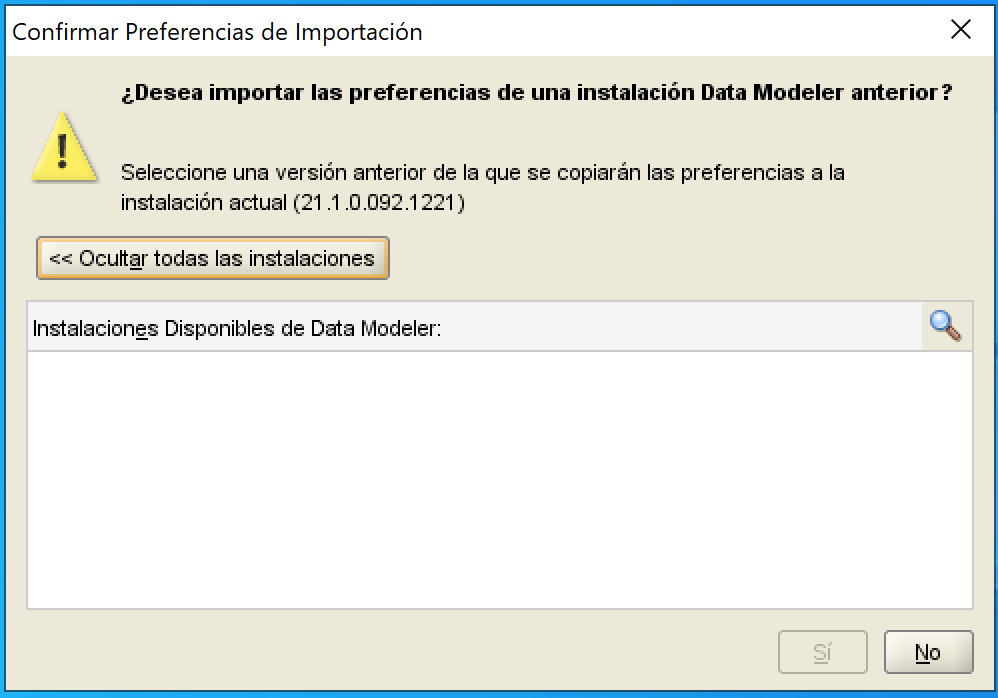
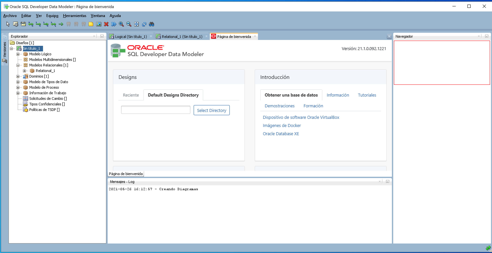

# Instalación de SQL Developer Data Modeler

[Volver](../readme.md)

## Requisitos

- [SQL Developer Data Modeler](https://www.oracle.com/es/database/technologies/appdev/datamodeler.html)

Las Herramientas de gestor de base de datos y modelado de oracle son gratuitas.

## Pasos a seguir

Esta herramienta nos permite crear la estructura de tablas de la base de datos de una manera mas sencilla, parecido al diseñador de base de datos de SQL Server o de Mysql.

Al ingresar al link de descarga de los requisitos podemos elegir entre las 2 opciones que nos ofrece oralce. *Para este ejemplo hemos elegido la versión de **Windows 64-bit with JDK included.***

Ahora extraemos el contenido del archivo .zip en una ubicación que sea de fácil acceso. Por ejemplo en la raíz del disco `C:` 

Vamos a ejecutar el programa mediante el archivo `datamodeler.exe`. Si es la primera ejecución nos preguntara si deseamos importar alguna configuración previa del programa 

Al finalizar la carga tendremos la siguiente vista del programa 
