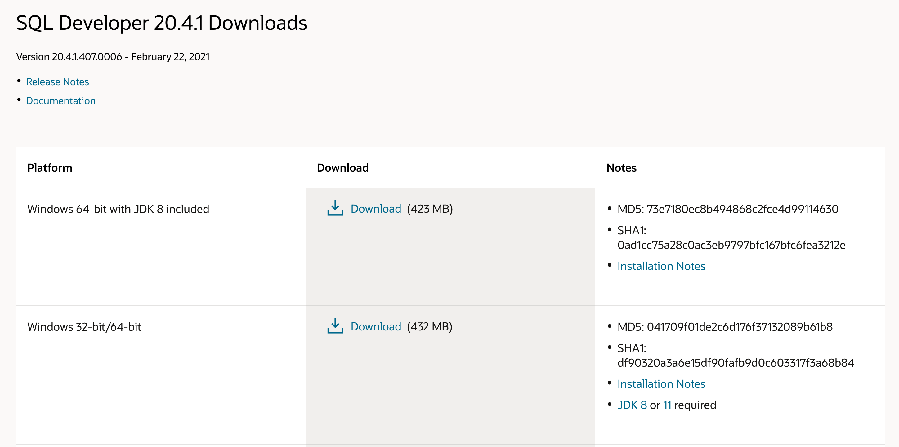
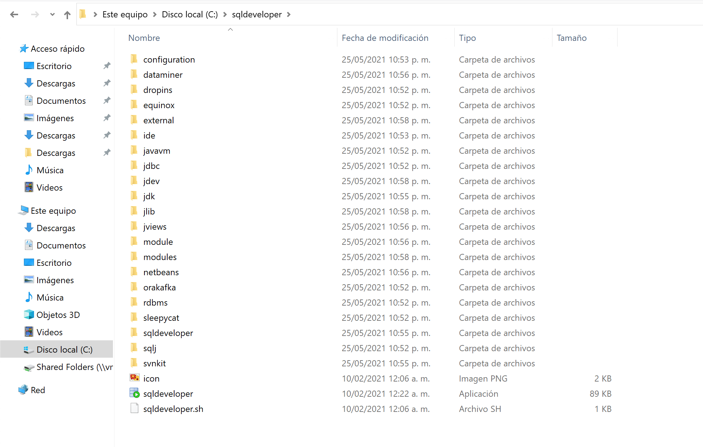
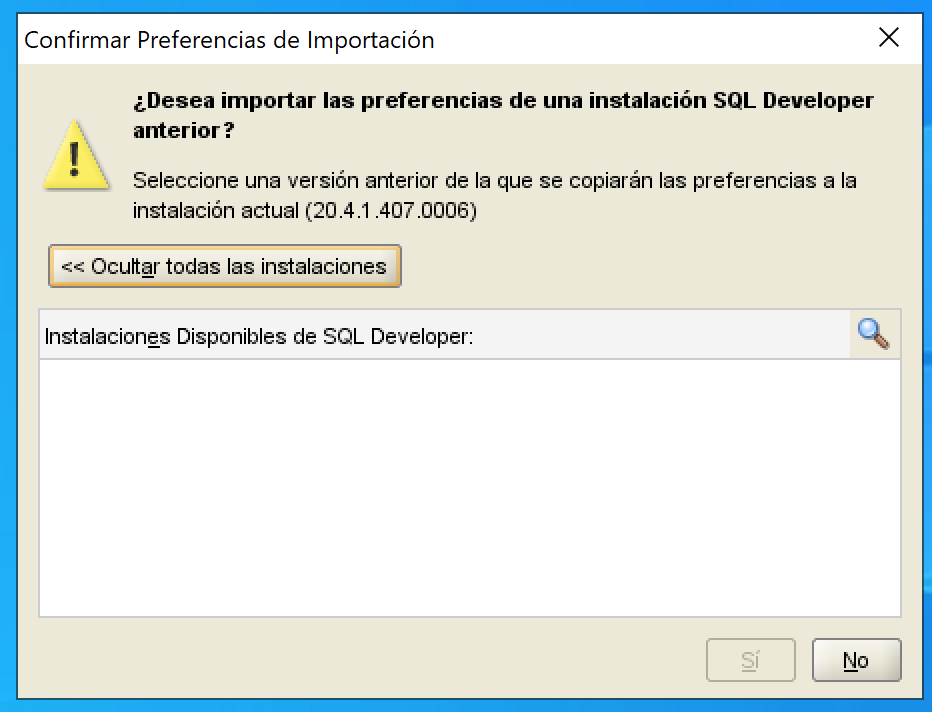
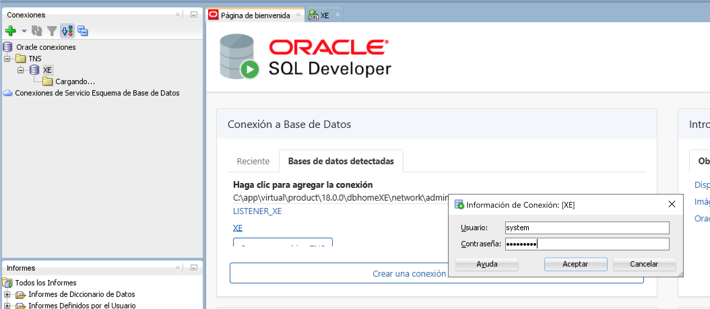
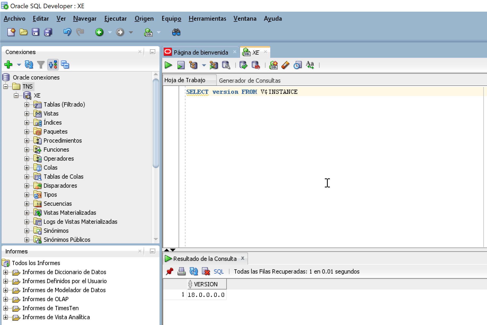

# Instalación de SQL Developer

[Volver](../readme.md)

## Requisitos

- Oracle Database XE. [Ver Instalación](OracleDBXE/readme.md)
- [SQL Developer](https://www.oracle.com/tools/downloads/sqldev-downloads.html)

Las Herramientas de gestor de base de datos y modelado de oracle son gratuitas.

## Pasos a Seguir

Para probar la instalación de la base de datos de Oracle utilizaremos esta herramienta que nos proporciona Oracle de forma gratuita. Usaremos la versión que incluye el JDK 8. 

Lo que haremos es descargar la herramienta desde el sitio oficial de oracle y luego extraemos el contenido del archivo .zip en una ubicación que sea de fácil acceso. Por ejemplo en la raíz del disco `C:` 

Ahora ejecutaremos el archivo `sqldeveloper.exe`. Al iniciar por primera vez no preguntara si queremos importar alguna configuracion previa del programa. 

Una vez cargado el programa podemos configurar la conexiones de base de datos. Este programa nos permite importar las configuraciones que están dentro de archivo de `<oracle_home>\network\admin\tnsnames.ora` el cual viene configurado cuando realizamos la instalación de la BD 

Al darle click en XE nos pedirá ingresar nuestras credenciales de acceso a la base de datos. Usaremos el usuario por defecto `system` y la contraseña que ingresamos durante la instalación de la BD. 

Finalmente probaremos la BD XE al ejecutar la siguiente consulta `SELECT version FROM V$INSTANCE;`