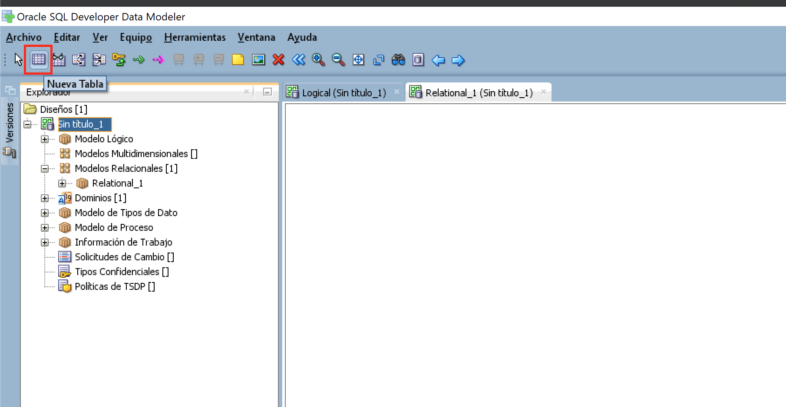
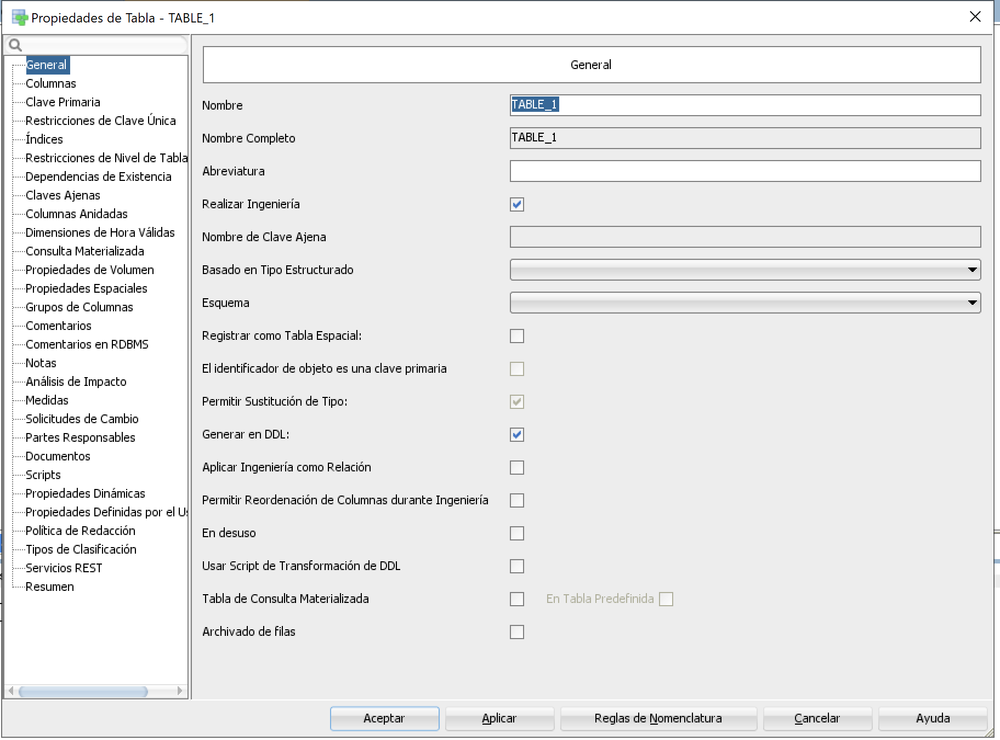
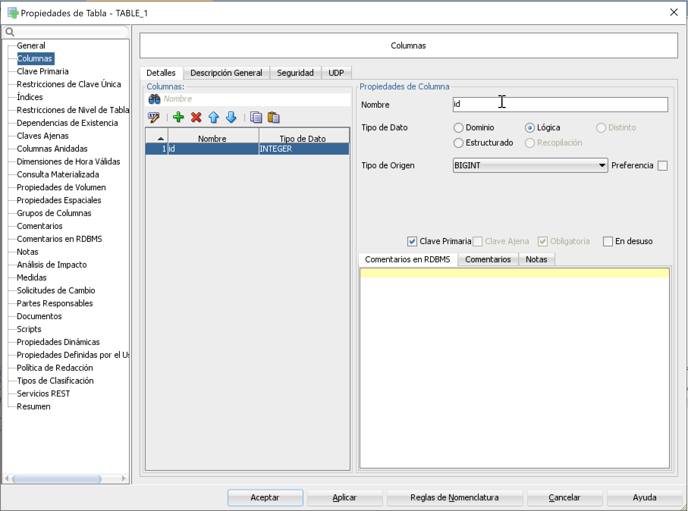
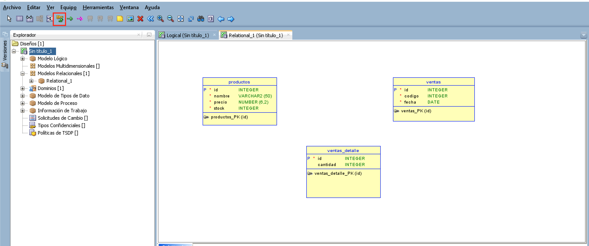
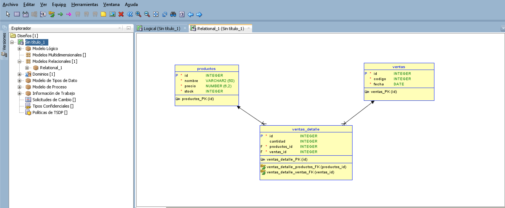
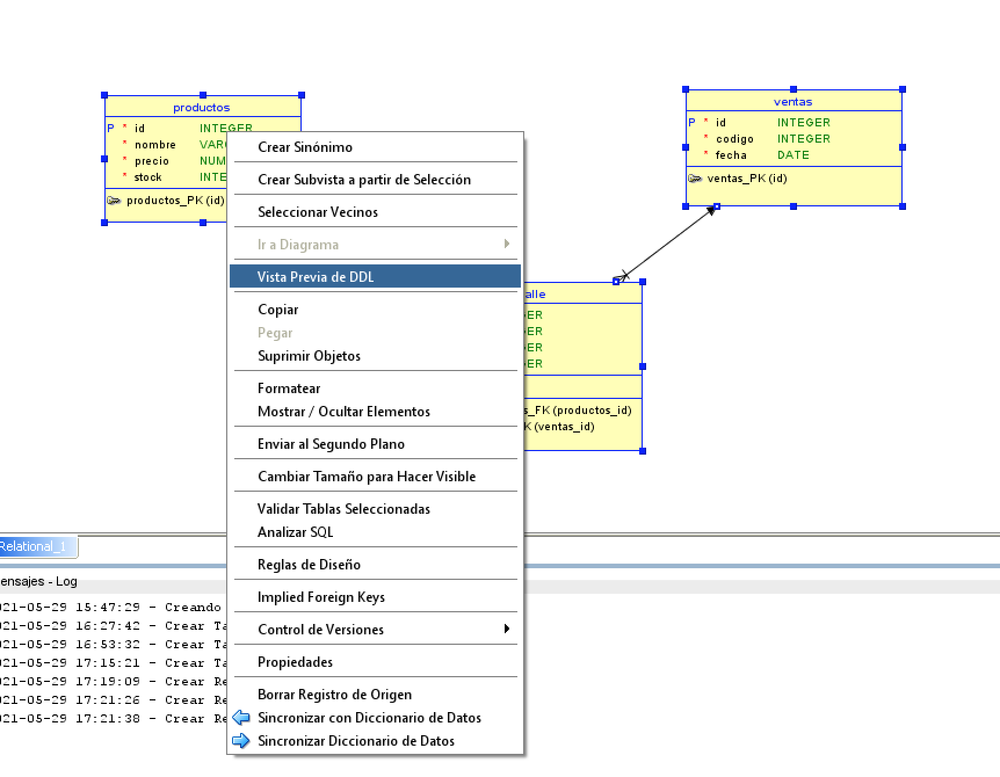
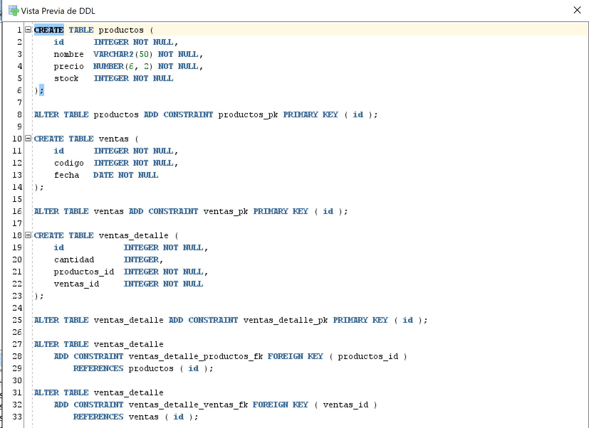
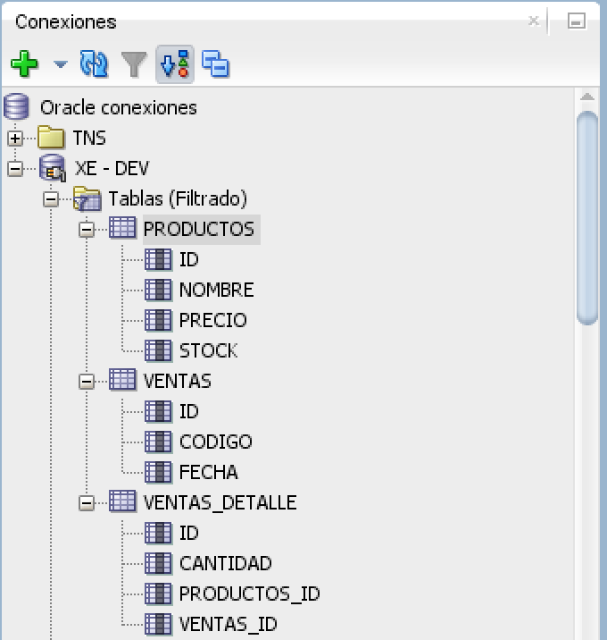

# INICIAR PROYECTOS .NET CON ORACLE

Vamos a explicar cómo podemos iniciar un proyecto base con C#. y Oracle DB XE.

## Requisitos

- Oracle Database XE. [Ver Instalación](OracleDBXE/readme.md)
- Oracle Data Provider for .NET [Ver Instalación](ODAC/readme.md)
- SQL Developer (Opcional). [Ver Instalación](SQL_Developer/readme.md)
- SQL Developer Data Modeler (Opcional). [Ver Instalación](SQL_DataModeler/readme.md)
- [VS 2019 community](https://visualstudio.microsoft.com/es/vs/community/)

*Las Herramientas de gestor de base de datos y modelado que brinda oracle son gratuitas.*

## Resumen

- [Modelo de Datos](#modelo-de-datos)
- [Base de Datos](#base-de-datos)
- [Creación del proyecto](#conexión-con-.net)

## Modelo de Datos

Usaremos Sql Data Modeles para el diseño de las tablas de base de datos. Abrimos la aplicación y nos ubicaremos dentro de la pestaña *Relational* para poder crear las tablas de nuestra BD.

En la barra de Herramientas seleccionamos el control de *Nueva Tabla* y luego hacemos click dentro del área en blanco de la pestaña "Relational" 

La primera vista nos permite detallar la información general de la tabla 

En la segunda vista podemos agrega los atributos que tendra nuestra tabla y el tipo de datos que tendra cada atributo. Para este caso sólo usaremos atributos del tipo Lógico 

En el caso que sea necesario realacionar las tablas podemos hacerlo metiante el icono de nueva relación. 

Debemos selecionar la tabla de origen y la de destino para poder enviar la clave foranea a las tablas correctamente. 

Una vez diseñado todas las tablas a utilizar podemos generar una vista previa del código DDL de las tablas generadas seleccionando las tablas y haciendo click derecho sobre una de ellas para elegir la opcion *Vista Previa DDL* 

El programa nos brindara el código DDL para la creación de las tablas y sus relaciones según el diseño que hemos hecho de las tablas.


## Base de Datos

Para empezar, vamos a crear un **tablespace** el cual nos va a permitir separar un espacio logico en oracle para nuestros esquemas y su respectivo usuario para trabajar con ella. Vamos a utilizar **Sql Developer** para ejecutar las consultas sql necesarias dentro de la base de datos XE con el usuario `system`.

**Importante:** *los nombres del tablespace y del usuario seran creados con mayusculas para evitar problemas de Case Sensitive al momento de hacer login o de ejecutar consultas*

Crearemos el el tablespace `MY_STORE` y su archivo de datos será `MY_STORE_001.dbf` el cual tendra un tamaño inicial de 10MB con un incremento automático de 10MB hasta alcanzar el tamaño maximo de 2GB asignado.

```sql
CREATE TABLESPACE MY_STORE
  DATAFILE 'MY_STORE_001.dbf'
  SIZE 10M AUTOEXTEND ON NEXT 10M MAXSIZE 2G
  EXTENT MANAGEMENT LOCAL;
```

Por defecto el tablespace se ha creado en el directorio donde esta ubicada la base de datos XE  `<oracle_home>\dbhomeXE\database`. Si queremos que los archivo de datos tengan otra ubicación podemos especificarlo junto con el nombre del archivo de la siguiente manera:

```sql
CREATE TABLESPACE MY_STORE
  DATAFILE 'c:/dataOracle/mybd/MY_STORE_001.dbf' 
  SIZE 10M AUTOEXTEND ON NEXT 10M MAXSIZE 2G
  EXTENT MANAGEMENT LOCAL;
```

En caso de querer eliminar el tablespace con todos sus archivos puede ejecutar lo siguiente:

```sql
DROP TABLESPACE MY_STORE
  INCLUDING CONTENTS AND DATAFILES CASCADE CONSTRAINTS;
```

Usaremos la siguiente consulta para crear un usuario que pueda administrar y acceder solo al tablespace hemos creado:

```sql
alter session set "_ORACLE_SCRIPT"=true;

CREATE USER STORE_DEV IDENTIFIED BY oracle123
DEFAULT TABLESPACE MY_STORE
ACCOUNT UNLOCK;
```

Y ahora vamos a habilitar al usuario para que pueda iniciar sesión en la base de datos junto con sus respectivos permisos sobre el tablespace creado:

```sql
GRANT CONNECT TO STORE_DEV;
GRANT CREATE SESSION TO STORE_DEV;
GRANT UNLIMITED TABLESPACE TO STORE_DEV;

-- PERMISOS PARA TABLAS
GRANT CREATE ANY TABLE TO STORE_DEV;
GRANT ALTER ANY TABLE TO STORE_DEV;
GRANT DROP ANY TABLE TO STORE_DEV;
GRANT SELECT ANY TABLE TO STORE_DEV;
GRANT DELETE ANY TABLE TO STORE_DEV;
GRANT INSERT ANY TABLE TO STORE_DEV;
GRANT UPDATE ANY TABLE TO STORE_DEV;

-- PEMISOS PARA LAS SECUENCIAS
GRANT ALTER ANY SEQUENCE TO STORE_DEV;
GRANT CREATE ANY SEQUENCE TO STORE_DEV;
GRANT DROP ANY SEQUENCE TO STORE_DEV;

-- PERMISOS PARA PROCEDIMIENTOS ALMACENADOS
GRANT CREATE PROCEDURE TO STORE_DEV;
```

*Para ver más permisos puede consultar el siguiente archivo [permisos.sql](scripts/permisos.sql)*

Finalmente, nos conectaremos a la base de datos con este nuevo usuario y crearemos algunas tablas para probar usando este [script](scripts/MYSTORE_tables.sql) de ejemplo. El resultado debe ser el siguiente: 

## Conexión con .Net
